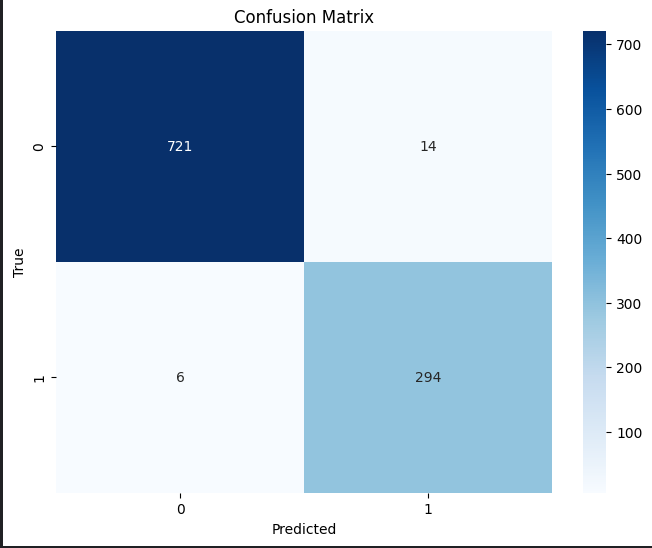

# Email Spam Classification Using Neural Networks

## Dataset
- Kaggle dataset "Email Spam Classification Dataset CSV"
- Features: Word frequency counts from email content
- Target: Binary classification (Spam/Non-spam)

**Important Note**: The dataset consists only of word frequencies rather than full email text. This constrains any feature engineering possibilities, as we cannot extract additional features like email structure, contextual patterns such has having text in bold, or full on senteces in capital letters which are both common attention grabbing techniques spam emails use. 

## Implementation Details

### Data Preprocessing
1. Loaded email dataset using pandas
2. Removed stopwords using NLTK's English stopwords list
3. Filtered out single and double character words
4. Total columns removed: 253 (including stopwords and short words such as "a", "th", "sh")

### Model Architecture
- Model: Multi-Layer Perceptron (MLPClassifier)
- Hidden Layers: (75, 25) neurons
  - Note: Experiments with larger neural networks did not yield better results.

### Training Process
- Data Split: 80% training, 20% testing
- Stratified sampling used to retain class distribution
- Best validation score: 0.98
- Model achieved good performance:
  - F1 Score: 0.967
  - Initial loss: 0.17356370
  - Final loss: 0.03008626

### Confusion Matrix

### Areas for Improvement
1. Dataset Limitations:
   - Current dataset only provides word frequencies
   - Access to full email content would enable the usage of other techniques such as:
     - Email structure patterns: such as having a lot of images included in the email body something not so common in non spam emails.
     - Contextual relationships between words: sentences such as "Click Here", "Recieve Gift", "Free money" are major giveaways that an email is spam/ 

### Potential Improvements with Full Email Text

1. Natural Language Processing Features:
   - Sentiment analysis: using this method you could gauge how positive or urgent the emotion in the email is. Senteces such as "amazing offer !!!" tend to be more prevalent in spam emails rather than normal emails which typically have a more neutral tone.

2. Email Structure Analysis:
   - HTML vs Plain Text Ratio: Spam often has lots of complicated formatting to be more attention grabbing.
   - Formatting Inconsistencies: Spam might use different fonts and styles to make it more apealing while normal emails may lack these features.
   - Font and Color Usage: Spam often uses bright colors and  different font sizes while normal emails use black text with the default font of the email application such as Calibri for Outlook.

Despite the dataset limitations, the model achieves goof performance, suggesting that word frequencies can be effective for spam detection. However, access to full email content would enable the use of more sophisticated methods like the above mentioned.